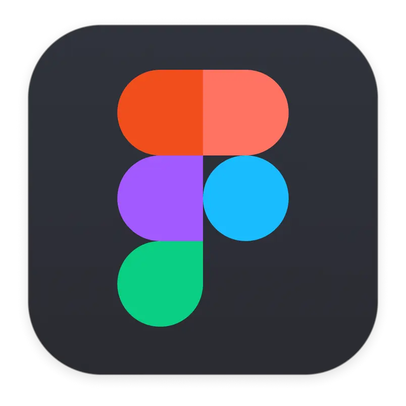

  
  

<h3>Hi there ~ </h3>

<h3>My name is <a href="https://t.me/sp0ngbik/">Vlad</a></h3>
  

<h3>⚡️ More about my coding life</h3>

---

### 📖 Stack :

  &nbsp;
  &nbsp;
  &nbsp;
  &nbsp;
  &nbsp;
  &nbsp;
  &nbsp;
  &nbsp;
  &nbsp;
  &nbsp;
  &nbsp;
  &nbsp;
  &nbsp;
  &nbsp;
  &nbsp;
  &nbsp;

## 🔗 Links

